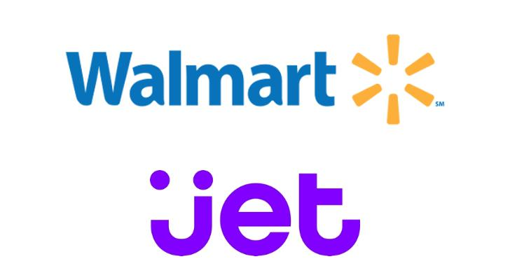

<!-- _class: white-text -->

# The Ergonomics of F#

Steve Goguen

---

# I asked a question on Twitter...

---


---

# ...and got a lot of responses!

But two in particular echoed my story...

---

<!-- _class: white-text -->


---


<!-- _class: white-text -->


---

# My Story

* 1990 - Started programming - QBasic, Pascal
* 1991 - Learned C++ - Was ❤️❤️❤️ about OOP
* 1996 - Got first job writing a Windows 95 app Visual C++ / MFC - ❤️❤️❤️

---

# 2006

* Was a web-developer
* Still loved OOP, Design Patterns, etc.
* Was super productive with SQL Server and loved writing stored-procedures
* Front-end - Had been building DHTML/AJAX apps without frameworks for 6 years
*  Friend introduced me to jQuery, lambdas, declarative/functional programming
* LINQ was previewed ❤️❤️❤️

---

# 2007

* LINQ was released in .NET 3.5 - I was hooked
* Got a new job & convinced them to let me use LINQ
* Wanted to know how it worked, learned about expression trees and things called monads
* What is this F# thing? 🤔

---

# 2007-2011

* I was a C# developer LINQifying everything
   * Upgrading old apps to .NET 3.5 and code golfing with LINQ
   * Wrote a LINQ Parser (Monadic Parser), Lazy LINQ, Linq Validation, etc. etc.
   * Was trying to invent my own RX.NET (It was terrible)
* Started learning F# - But my heart was still with C#
* Erik Meijer previews Reactive Extensions (RX) at PDC 2009 😲
* F# was open sourced in 2010
* And then NYC F# Meetup Group started in 2011...

---

# I Found My People

They understood me!


---


# F# was Going to Change Everything!

---

# I Started Writing F# at Work!

---


---

Meanwhile...

---

# Jet.com is Born

* Taking on Amazon!
* Built with F#!
* Many F# jobs!
* Many F# talks!


---

# Walmart Buys Jet.com

* F# jobs start disappearing in NYC
* F# talks stop happening
* Still popular in Europe!



---

# Here We Are Today

* F# is still awesome!
* But it's not taking over the world
* But it has changed the world and has **directly** influenced TypeScript, JavaScript, C#, and more  (Async/Await, LINQ, etc.)
* It has quite literally influenced the designs of Swift, Kotlin, and Rust
* And it will continue to lend its ideas to other languages
* You will continue to get language features from F# in other languages for years to come for one big reason...

---

# The Ergonomics

---

# What are Ergonomics?

* The study of people's efficiency in their working environment
* The goal is to reduce effort and increase efficiency
* In programming, this means reducing cognitive load and improving understanding

---

# This is why we have things like:
   * Static typing
   * Type inference
   * Pattern matching / Active Patterns
   * REPLs / Interactive environments
   * Domain Specific Languages (DSLs)
   * Composable Abstractions
   * Higher-order functions
   * Bridging OOP and FP

---

# But to understand why, we need to go back to the beginning...

We need to talk about ML

---

# ML - The Progamming Language (Not Machine Learning)

* F# is a member of the ML language family (OCaml, F#, SML, Elm, etc.)
* It's the result of Don Syme wanting to bring the power of OCaml to the .NET platform
* He even added Generics to .NET to make it possible.
   * I'm serious!
   * .NET generics were designed to be powerful enough to support ML's type system without contorting the compiler.
* But ML goes back to 1973 when Robin Milner and others needed a programming language to automated theorem prover tactics.

---

# ML - Birthed from Theorem Provers

* ML was born from the LCF (Logic for Computable Functions) project at Stanford
* The goal was to create a theorem prover that could be trusted
* LCF has become the basis for many theorem provers today
* Theorem provers are used to prove mathematical theorems
* They are used in formal verification of software and hardware
* When writing theorem tactics - You want a language you can trust
* When it compiles, it's correct to a degree

---

# A Language to Describe Mathematical Objects

```fsharp
type Proposition = 
   | And of Proposition * Proposition
   | Or of Proposition * Proposition
   | Implies of Proposition * Proposition
   | Not of Proposition
   | True
   | False
```

---

# A Language to Transform Mathematical Objects

```fsharp
let rec simplify = function
   | And (True, p) | And (p, True)         -> simplify p
   | And (False, _) | And (_, False)       -> False
   | Or (True, _) | Or (_, True)           -> True
   | Or (False, p) | Or (p, False)         -> simplify p
   | Implies (True, p) | Implies (_, True) -> simplify p
   | Implies (False, _)                    -> True
   | Implies (p, False)                    -> Not (simplify p)
   | Not True                              -> False
   | Not False                             -> True
   | Not p                                 -> Not (simplify p)   
   | p                                     -> p
```

---

# The Motivation for ML

* It's not enough to just write programs the transform symbols
* The compiler needs to be able to reason about the correctness of the program from a typed perspective
* While Lisp was the first language to use lambda calculus, it was untyped
* ML not only used a typed lambda calculus, but it also used a type system that could infer types
* This type inference system is called Hindley-Milner
* And it's way more powerful than you might think

---

# Let's Play with It!

Looking for [the code](./math-objects.fsx)?

---

# Play Agenda

* Define custom operators - Notice how the compiler infers the types!
* Let's explore incomplete pattern matching warnings

---

# Currying & Partial Application

--- 

# Currying

Turning functions with multiple arguments into a series of functions that take a single argument

```typescript
function add(x: int, y: int): int {
   return x + y
}
```

Curried

```typescript
function add(x: int) {
   return function(y: int): int {
      return x + y
   }
}
```

* F# and ML are curried by default

---

## Partial Application

When you call a function with fewer arguments than it expects, it returns a function that takes the remaining arguments


```typescript
function add(x: int) {
   return function(y: int): int {
      return x + y
   }
}

const addOne = add(1);
const result = addOne(2); // 3
```

---

## Currying & Partial Application in F#

```fsharp
let add x y = x + y
let addOne = add 1
let result = addOne 2 // 3
```

---

# Using Currying to Incrementally Abstract a Function

Let's define a normal function that add up some integers

```fsharp
let sum list = 
   let mutable result = 0
   for i in list do
      result <- result + i
   result
```

[Let's play](../examples/sum.fsx)

---

# Let's Add a Parameter

We may add an initial value

```fsharp
let sum initalValue list = 
   let mutable result = initalValue
   for i in list do
      result <- result + i
   result
```

---

# Adding a Final Parameter to Make it Generic

* We can pass a function as a parameter
* And turn our "sum" into a higher-order function called fold

```fsharp
let fold f initalValue list = 
   let mutable result = initalValue
   for i in list do
      result <- f result i
   result
```

---

# Currying

---
