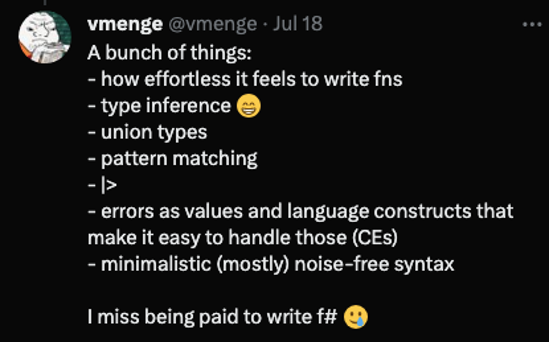

# ML - The Progamming Language (Not Machine Learning)

* F# is a member of the ML language family (OCaml, F#, SML, Elm, etc.)
* It's the result of Don Syme wanting to bring the power of OCaml to the .NET platform
* He even added Generics to .NET to make it possible.
   * I'm serious!
   * .NET generics were designed to be powerful enough to support ML's type system without contorting the compiler.
* But ML goes back to 1973 when Robin Milner and others needed a programming language to automated theorem prover tactics.

---

# ML - Birthed from Theorem Provers

* ML was born from the LCF (Logic for Computable Functions) project at Stanford
* The goal was to create a theorem prover that could be trusted
* LCF has become the basis for many theorem provers today
* Theorem provers are used to prove mathematical theorems
* They are used in formal verification of software and hardware
* When writing theorem tactics - You want a language you can trust
* When it compiles, it's correct to a degree

---

# A Language to Describe Mathematical Objects

```fsharp
type Proposition = 
   | And of Proposition * Proposition
   | Or of Proposition * Proposition
   | Implies of Proposition * Proposition
   | Not of Proposition
   | True
   | False
```

---



---

# A Language to Transform Mathematical Objects

```fsharp
let rec simplify = function
   | And (True, p) | And (p, True)         -> simplify p
   | And (False, _) | And (_, False)       -> False
   | Or (True, _) | Or (_, True)           -> True
   | Or (False, p) | Or (p, False)         -> simplify p
   | Implies (True, p) | Implies (_, True) -> simplify p
   | Implies (False, _)                    -> True
   | Implies (p, False)                    -> Not (simplify p)
   | Not True                              -> False
   | Not False                             -> True
   | Not p                                 -> Not (simplify p)   
   | p                                     -> p
```

---

# The Motivation for ML

* It's not enough to just write programs the transform symbols
* The compiler needs to be able to reason about the correctness of the program from a typed perspective
* While Lisp was the first language to use lambda calculus, it was untyped
* ML not only used a typed lambda calculus, but it also used a type system that could infer types
* This type inference system is called Hindley-Milner
* And it's way more powerful than you might think

---

# [Play Time!](./math-objects.fsx)

* Let's explore this pattern matching language!
* Define custom operators - Notice how the compiler infers the types!